<p align="center">
  <a href="https://kwatch.dev">
    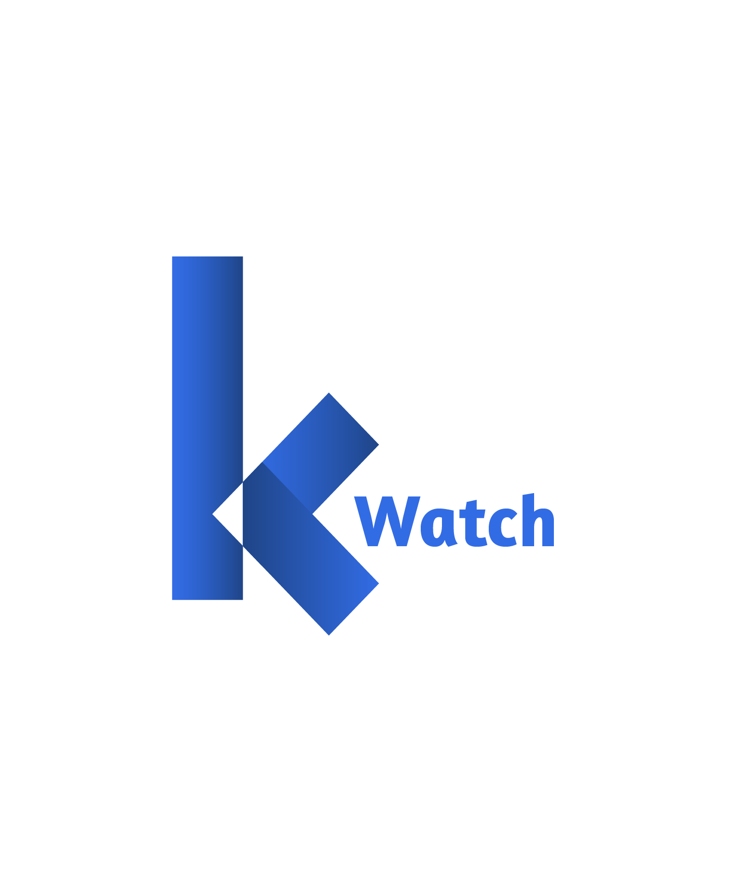
  </a>
  <br />
  <a href="https://kwatch.dev">
    
  </a>
  <a href="https://godoc.org/github.com/abahmed/kwatch">
    
  </a>
  <a href="https://github.com/abahmed/kwatch/actions/workflows/check.yaml">
    
  </a>
  <a href="https://goreportcard.com/report/github.com/abahmed/kwatch">
    
  </a>
  <a href="https://codecov.io/gh/abahmed/kwatch">
    
  </a>
  <a href="https://github.com/abahmed/kwatch/releases/latest">
    
  </a>
  <a href="https://discord.gg/kzJszdKmJ7">
    
  </a>
</p>

**kwatch** helps you monitor all changes in your Kubernetes(K8s) cluster, detects crashes in your running apps in realtime, and publishes notifications to your channels (Slack, Discord, etc.) instantly

## ⚡️ Getting Started

### Install

#### Using Helm

```shell
helm repo add kwatch https://kwatch.dev/charts
helm install [RELEASE_NAME] kwatch/kwatch --namespace kwatch --create-namespace --version 0.10.3
```

To get more details, please check [chart's configuration](https://github.com/abahmed/kwatch/blob/main/deploy/chart/README.md)

#### Using kubectl

You need to get config template to add your configs

```shell
curl  -L https://raw.githubusercontent.com/abahmed/kwatch/v0.10.3/deploy/config.yaml -o config.yaml
```

Then edit `config.yaml` file and apply your configuration

```shell
kubectl apply -f config.yaml
```

To deploy **kwatch**, execute following command:

```shell
kubectl apply -f https://raw.githubusercontent.com/abahmed/kwatch/v0.10.3/deploy/deploy.yaml
```

## High Level Architecture

<p>
 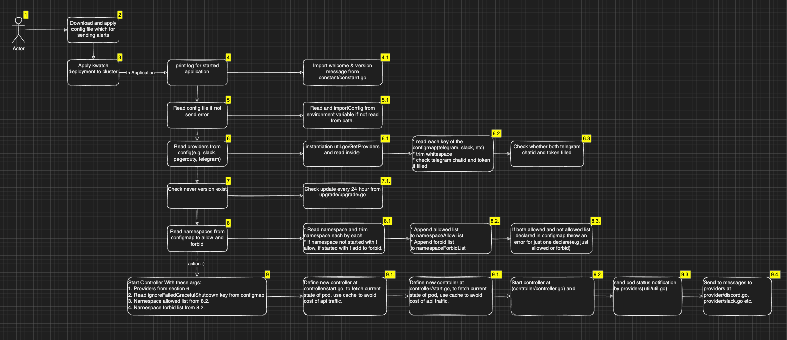
</p>

| Point                            | URL                                                                               |
|:---------------------------------|:--------------------------------------------------------------------------------- |
| `4.1`                            | <https://github.com/abahmed/kwatch/blob/main/main.go#L18>                           |
| `5.1.`                           | <https://github.com/abahmed/kwatch/blob/main/main.go#L21> / 24                      |
| `6.1.`                           | <https://github.com/abahmed/kwatch/blob/main/main.go#L36>                           |
| `7.0.`                           | <https://github.com/abahmed/kwatch/blob/main/main.go#L40>                           |
| `7.1.`                           | <https://github.com/abahmed/kwatch/blob/main/upgrader/upgrader.go#L16>              |
| `8.1.&8.2`                       | <https://github.com/abahmed/kwatch/blob/main/main.go#L46> / 52                      |
| `8.3.`                           | <https://github.com/abahmed/kwatch/blob/main/main.go#L53>                           |
| `9.0.`                           | <https://github.com/abahmed/kwatch/blob/main/main.go#L58>                           |
| `9.1.`                           | <https://github.com/abahmed/kwatch/blob/main/controller/start.go#L20>               |
| `9.2.`                           | <https://github.com/abahmed/kwatch/blob/main/controller/controller.go#L37>          |
| `9.3.`                           | <https://github.com/abahmed/kwatch/blob/main/controller/controller.go>              |
| `9.4.`                           | <https://github.com/abahmed/kwatch/tree/main/provider>                              |

## Configuration

### General

| Parameter                      | Description   |
|:-------------------------------|:-----------------------|
| `maxRecentLogLines`            | Optional Max tail log lines in messages, if it's not provided it will get all log lines |
| `namespaces`                   | Optional list of namespaces that you want to watch or forbid, if it's not provided it will watch all namespaces. If you want to forbid a namespace, configure it with `!<namespace name>`. You can either set forbidden namespaces or allowed, not both. |
| `reasons`                      | Optional list of reasons that you want to watch or forbid, if it's not provided it will watch all reasons. If you want to forbid a reason, configure it with `!<reason>`. You can either set forbidden reasons or allowed, not both.                     |
| `ignoreFailedGracefulShutdown` | If set to true, containers which are forcefully killed during shutdown (as their graceful shutdown failed) are not reported as error     |
| `ignoreContainerNames`         | Optional list of container names to ignore    |
| `ignorePodNames`               | Optional list of pod name regexp patterns to ignore    |
| `IgnoreLogPatterns`            | Optional list of regexp patterns of logs to ignore     |


### App

| Parameter                     | Description                                 |
|:------------------------------|:------------------------------------------- |
| `app.proxyURL` | used in outgoing http(s) requests except Kubernetes requests to cluster optionally |
| `app.clusterName` | used in notifications to indicate which cluster has issue |
| `app.disableStartupMessage` | If set to true, welcome message will not be sent to notification channels |
| `app.logFormatter` | used for setting custom formatter when app prints logs: text, json (default: text) |


### Upgrader

| Parameter                     | Description                                 |
|:------------------------------|:------------------------------------------- |
| `upgrader.disableUpdateCheck` | If set to true, does not check for and notify about kwatch updates |

### PVC Monitor

| Parameter                    | Description                                 |
|:-----------------------------|:------------------------------------------- |
| `pvcMonitor.enabled`         | to enable or disable this module (default: true) |
| `pvcMonitor.interval`        | the frequency (in minutes) to check pvc usage in the cluster  (default: 15) |
| `pvcMonitor.threshold`       | the percentage of accepted pvc usage. if current usage exceeds this value, it will send a notification (default: 80) |


### Node Monitor

| Parameter                    | Description                                 |
|:-----------------------------|:------------------------------------------- |
| `nodeMonitor.enabled`        | to enable or disable node monitoring (default: true) |


### Alerts

#### Slack

<p>
  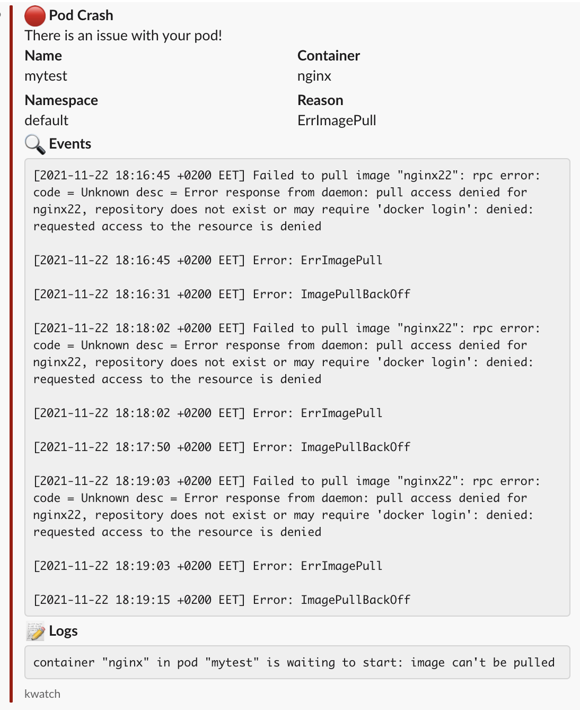
</p>

If you want to enable Slack, provide the webhook with optional text and title

| Parameter                        | Description                                 |
|:---------------------------------|:------------------------------------------- |
| `alert.slack.webhook`            | Slack webhook URL                           |
| `alert.slack.channel`            | Used by legacy webhooks to send messages to specific channel instead of default one |
| `alert.slack.title`              | Customized title in slack message           |
| `alert.slack.text`               | Customized text in slack message            |

#### Discord

<p>
  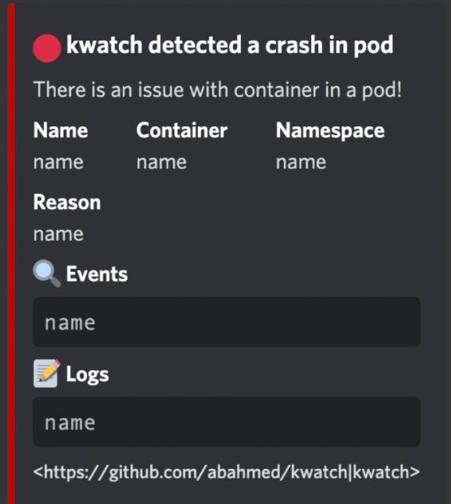
</p>

If you want to enable Discord, provide the webhook with optional text and title

| Parameter                        | Description                                 |
|:---------------------------------|:------------------------------------------- |
| `alert.discord.webhook`          | Discord webhook URL                         |
| `alert.discord.title`            | Customized title in discord message         |
| `alert.discord.text`             | Customized text in discord message          |

#### Email

<p>
  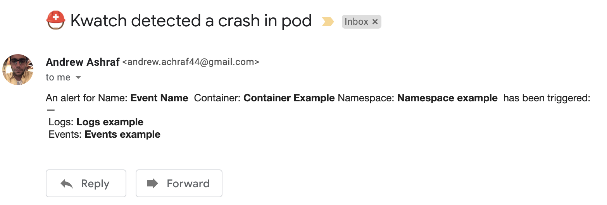
</p>

If you want to enable Email, provide the from and to emails with host and the port

| Parameter                        | Description                                 |
|:---------------------------------|:------------------------------------------- |
| `alert.email.from`               | From email                                  |
| `alert.email.password`           | From email Password                         |
| `alert.email.host`               | provide the host                            |
| `alert.email.port`               | provide the port                            |
| `alert.email.to`                 | the receiver email                          |

#### PagerDuty

<p>
  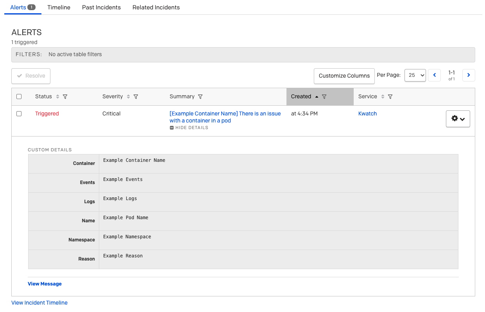
</p>

If you want to enable PagerDuty, provide the integration key

| Parameter                        | Description                                 |
|:---------------------------------|:------------------------------------------- |
| `alert.pagerduty.integrationKey` | PagerDuty integration key [more info](https://support.pagerduty.com/docs/services-and-integrations) |

#### Telegram

<p>
  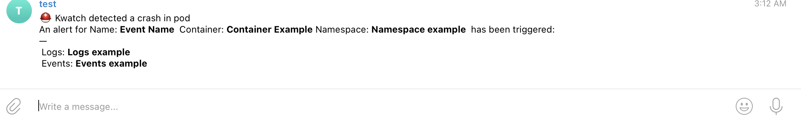
</p>

If you want to enable Telegram, provide a valid token and the chat Id.

| Parameter                        | Description                                     |
|:---------------------------------|:------------------------------------------------|
| `alert.telegram.token`           | Telegram token                                  |
| `alert.telegram.chatId`          | Telegram chat id                                |

#### Microsoft Teams

<p>
  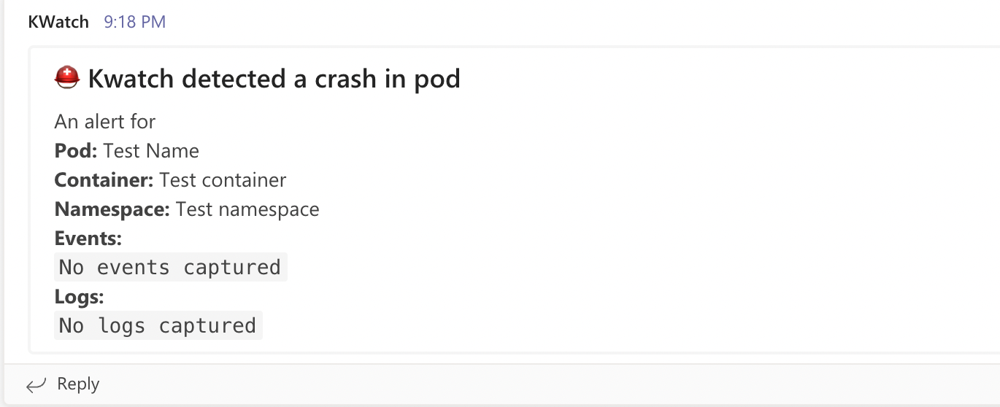
</p>

If you want to enable Microsoft Teams, provide the channel webhook.

| Parameter                        | Description                                     |
|:---------------------------------|:------------------------------------------------|
| `alert.teams.webhook`            |  webhook Microsoft team                         |
| `alert.teams.title`              | Customized title in Microsoft teams message     |
| `alert.teams.text`               | Customized title in Microsoft teams message     |

#### Rocket Chat

<p>
  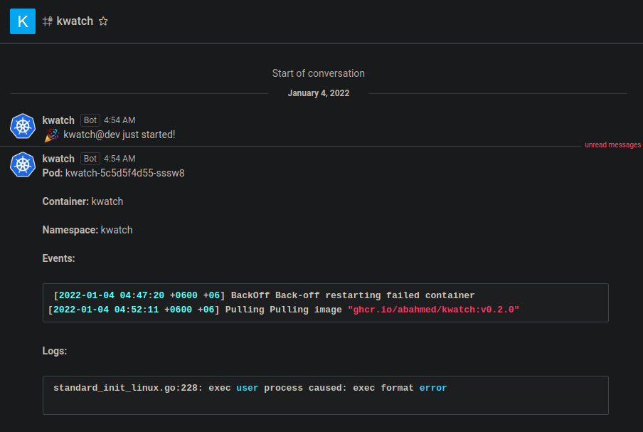
</p>

If you want to enable Rocket Chat, provide the webhook with optional text

| Parameter                  | Description                            |
|:---------------------------|:---------------------------------------|
| `alert.rocketchat.webhook` | Rocket Chat webhook URL                |
| `alert.rocketchat.text`    | Customized text in rocket chat message |

#### Mattermost

<p>
  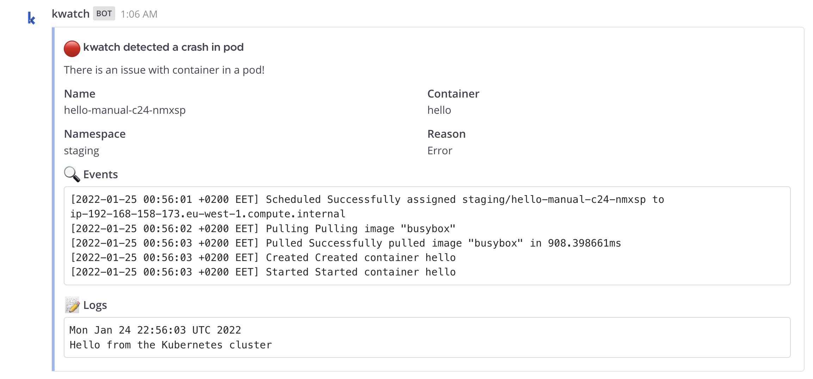
</p>

If you want to enable Mattermost, provide the webhook with optional text and title

| Parameter                             | Description                               |
|:--------------------------------------|:----------------------------------------- |
| `alert.mattermost.webhook`            | Mattermost webhook URL                    |
| `alert.mattermost.title`              | Customized title in Mattermost message    |
| `alert.mattermost.text`               | Customized text in Mattermost message     |

#### Opsgenie

<p>
  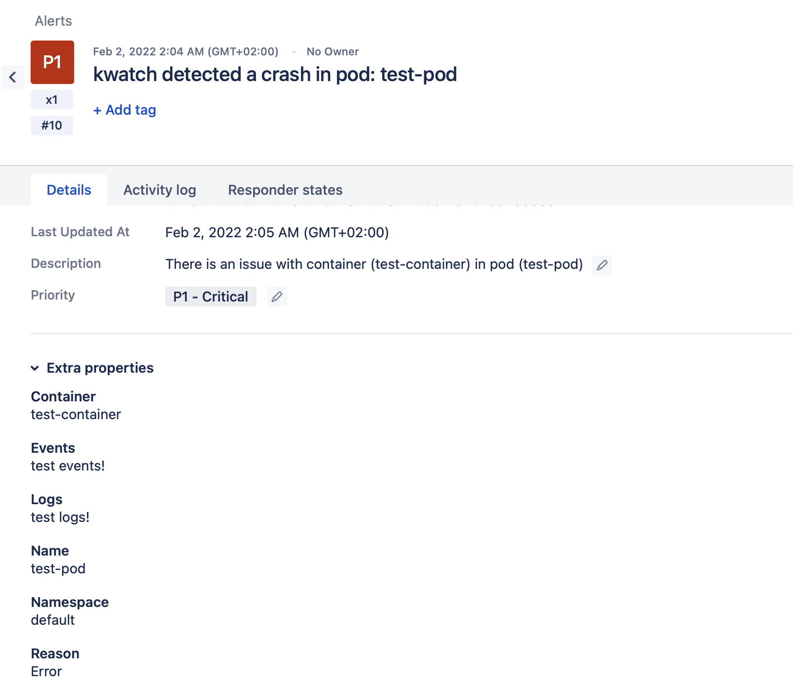
</p>

If you want to enable Opsgenie, provide the API key with optional text and title

| Parameter                             | Description                             |
|:--------------------------------------|:--------------------------------------- |
| `alert.opsgenie.apiKey`               | Opsgenie API Key                        |
| `alert.opsgenie.title`                | Customized title in Opsgenie message    |
| `alert.opsgenie.text`                 | Customized text in Opsgenie message     |

#### Matrix

<p>
  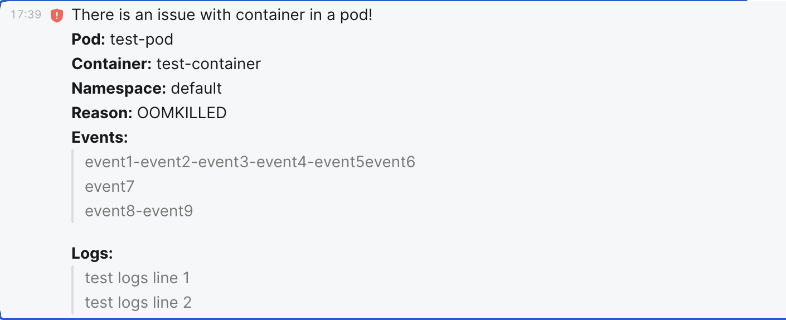
</p>

If you want to enable Matrix, provide homeServer, accessToken and internalRoomID
with optional text and title

| Parameter                           | Description                            |
|:------------------------------------|:-------------------------------------- |
| `alert.matrix.homeServer`           | HomeServer URL                         |
| `alert.matrix.accessToken`          | Account access token                   |
| `alert.matrix.internalRoomID`       | Internal room ID                       |
| `alert.matrix.title`                | Customized title in message            |
| `alert.matrix.text`                 | Customized text in message             |

#### DingTalk

If you want to enable DingTalk, provide accessToken with optional secret and
title

| Parameter                           | Description                            |
|:------------------------------------|:-------------------------------------- |
| `alert.dingtalk.accessToken`        | Chat access token                      |
| `alert.dingtalk.secret`             | Optional secret used to sign requests  |
| `alert.dingtalk.title`              | Customized title in message            |

#### FeiShu

<p>
  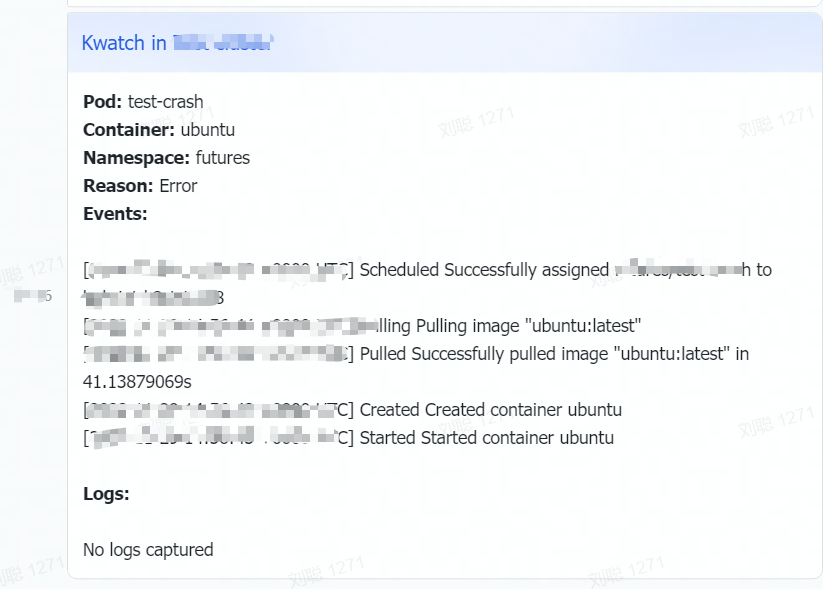
</p>
If you want to enable FeiShu, provide accessToken with optional secret and
title

| Parameter                | Description                 |
|:-------------------------|:----------------------------|
| `alert.feishu.webhook`   | FeiShu bot webhook URL      |
| `alert.feishu.title`     | Customized title in message |

#### Zenduty

<p>
  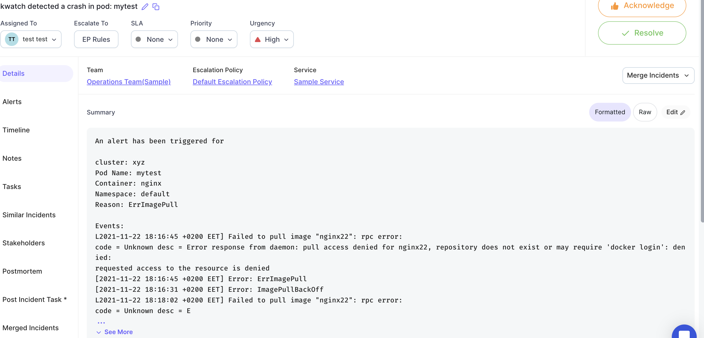
</p>
If you want to enable Zenduty, provide IntegrationKey with optional alert type

| Parameter                      | Description                 |
|:-------------------------------|:----------------------------|
| `alert.zenduty.integrationKey` | Zenduty integration Key     |
| `alert.zenduty.alertType`      | Optional alert type of incident: critical, acknowledged, resolved, error, warning, info (default: critical) |

#### Google Chat

<p>
  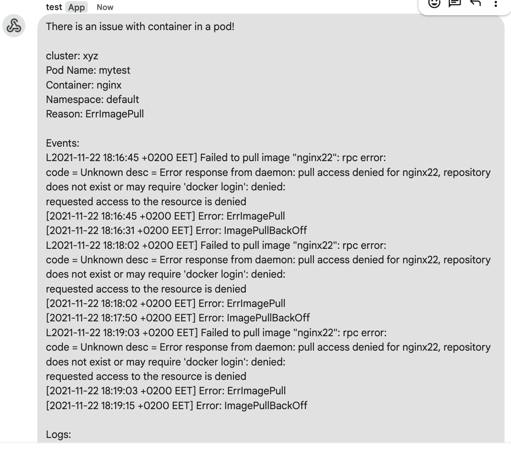
</p>

If you want to enable Rocket Chat, provide the webhook with optional text

| Parameter                  | Description                            |
|:---------------------------|:---------------------------------------|
| `alert.googlechat.webhook` | Google Chat webhook URL                |
| `alert.rocketchat.text`    | Customized text in Google Chat message |

#### Custom webhook

If you want to enable custom webhook, provide url with optional headers and
basic auth

| Parameter                 | Description                     |
|:--------------------------|:--------------------------------|
| `alert.webhook.url`       | Webhook URL                     |
| `alert.webhook.headers`   | optional list of name and value |
| `alert.webhook.basicAuth` | optional username and password  |

### Cleanup

```shell
kubectl delete -f https://raw.githubusercontent.com/abahmed/kwatch/v0.10.3/deploy/config.yaml
kubectl delete -f https://raw.githubusercontent.com/abahmed/kwatch/v0.10.3/deploy/deploy.yaml
```

## 👍 Contribute & Support

+ Add a [GitHub Star](https://github.com/abahmed/kwatch/stargazers)
+ [Suggest new features, ideas and optimizations](https://github.com/abahmed/kwatch/issues)
+ [Report issues](https://github.com/abahmed/kwatch/issues)

## 🚀 Who uses kwatch?

**kwatch** is being used by multiple entities including, but not limited to

[](https://www.trella.app)
[](https://ibecsystems.com/en#/)
[](https://www.justwatch.com/us/talent)

If you want to add your entity, [open issue](https://github.com/abahmed/kwatch/issues) to add it

## 💻 Contributors

<a href="https://github.com/abahmed/kwatch/graphs/contributors">
  
</a>

## ⭐️ Stargazers


## 👋 Get in touch

Feel free to chat with us on [Discord](https://discord.gg/kzJszdKmJ7) if you have questions, or suggestions

## ⚠️ License

kwatch is licensed under [MIT License](LICENSE)
