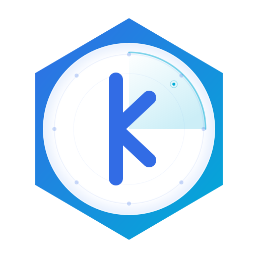

<p align="center">
  <a href="https://kwatch.dev">
    
  </a>
  <br />
  <a href="https://kwatch.dev">
    
  </a>
  <a href="https://pkg.go.dev/github.com/abahmed/kwatch">
    
  </a>
  <a href="https://github.com/abahmed/kwatch/actions/workflows/check.yaml">
    
  </a>
  <a href="https://goreportcard.com/report/github.com/abahmed/kwatch">
    
  </a>
  <a href="https://codecov.io/gh/abahmed/kwatch">
    
  </a>
  <a href="https://github.com/abahmed/kwatch/releases/latest">
    
  </a>
  <a href="https://github.com/abahmed/kwatch/blob/main/LICENSE">
    
  </a>
  <a href="https://github.com/abahmed/kwatch">
    
  </a>
  <a href="https://artifacthub.io/packages/helm/kwatch/kwatch">
    
  </a>
  <a href="https://discord.gg/kzJszdKmJ7">
    
  </a>
</p>

> **👋 New to Kubernetes? No problem.**  
> kwatch watches your cluster 24/7. When something fails, it tells you **what broke and why** — with the error reason, diagnostic hints, logs, and events — straight to your team chat.  
> ✨ **60 seconds to install. No backend. No dashboards. No YAML spaghetti.**

---

## 🧐 What is kwatch?

kwatch is like a **smart friend** for your Kubernetes cluster:

- 💥 Something crashes → you get a message that says *why* (not just "pod is broken")
- 🔇 Smart about noise — groups related issues, ignores flapping, sends a digest when things get crazy
- 🧠 Optional AI that reads the logs and tells you what's likely wrong
- ⚡ Works in **under a minute** — just one command and a config file

No Prometheus. No Grafana. No 50-step setup. Just alerts that **make sense**.

---

## 🆚 kwatch vs the scary stuff

| | ✨ kwatch | 😰 DIY Prometheus + Alertmanager | 💸 Heavy SaaS |
|---|---|---|---|
| ⏱️ Setup time | **~5 minutes** | hours of YAML | agent + backend setup |
| 📦 Size | ~20 MB single binary | whole monitoring stack | per-node agents + cloud costs |
| 💬 Alerts | Self-explaining ("OOMKilled — raise memory limit") | Rule-defined message | Depends on configuration |
| 🗄️ Storage | None (stateless) | Prometheus TSDB | Full retention (costly) |
| 📚 Learning curve | One ConfigMap | PromQL + alert rules | Platform-specific DSL |

---

## 🚨 Before vs After

| Raw kubectl output 🤷 | kwatch tells you 💡 |
|---|---|
| `CrashLoopBackOff` | 🚨 **OOMKilled** (memory limit: 512Mi) — try raising `limits.memory` · here are the logs + events |
| `Error` | 🚨 **HTTP probe** failing on `:8080/healthz` (exit 137) — container ran out of memory |

---

## ⚡️ 60-second install

### 📦 Helm (easiest 🏆)

```shell
helm repo add kwatch https://kwatch.dev/charts
helm install [RELEASE_NAME] kwatch/kwatch --namespace kwatch --create-namespace --version 0.11.0
```

More details in the [chart docs](https://github.com/abahmed/kwatch/blob/main/deploy/chart/README.md)

### 🐙 kubectl

```shell
curl -L https://raw.githubusercontent.com/abahmed/kwatch/v0.11.0/deploy/config.yaml -o config.yaml
# ✏️ Edit config.yaml with your Slack/Discord/email webhook
kubectl apply -f config.yaml
kubectl apply -f https://raw.githubusercontent.com/abahmed/kwatch/v0.11.0/deploy/deploy.yaml
```

---

## 🎯 What does it catch?

Every monitor below is **on by default** — zero config needed:

| Signal | Default | What you get |
|--------|---------|-------------|
| 🟥 Pod crashes (CrashLoop, OOM, ImagePull, Error) | ✅ **on** | Container state + previous logs + events — tells you *why* |
| ⏳ Pending pods (stuck Unschedulable) | ✅ **on** | Alerts after 300s stuck |
| 🖥️ Node issues (NotReady, Disk/Memory pressure) | ✅ **on** | Per-condition severity |
| 💾 PVC running out of space | ✅ **on** | Warn at 80%, critical at 90% |
| ❌ Failed Jobs | ✅ **on** | `JobFailed` / `JobSuspended` |
| 🚀 Stuck rollouts | ✅ **on** | `ProgressDeadlineExceeded` — deployment didn't finish |
| 📡 DaemonSet pods not running | ✅ **on** | Unavailable pods detected |
| ⏰ CronJob suspended or missing runs | ✅ **on** | Not scheduled in 24h? Alert. |
| 📈 HPA stuck at max replicas | ✅ **on** | After 20 minutes sustained |
| 🔒 TLS certs expiring | ❌ off | Enable if you want cert expiry warnings |

✅ **TLS is the only one off** — everything else just works out of the box.

---

## 🤖 AI-powered troubleshooting (optional, on by default)

kwatch ships with **built-in AI** (runs inside your cluster — zero data leaves):

```yaml
llm:
  enabled: true   # ✅ on by default!
```

When a crash happens, the AI reads the logs and tells you the **most likely cause** and **what to do next**. Like having a senior SRE on-call with you.

> **📌 Architecture note:** AI is available for **linux/amd64** and **linux/arm64** only. It does not support `arm/v6` or `arm/v7` (the main kwatch image supports all four).

---

## ⚙️ Configuration (simple)

### 🔧 General

| Parameter | What it does |
|:---|---|
| `maxRecentLogLines` | How many log lines to include in alerts (default: 50) |
| `resyncSeconds` | Check for problems periodically (0 = only on events, recommended) |
| `workers` | How many parallel workers (default: 1, raise for big clusters) |
| `namespaces` | 🔽 Limit to specific namespaces, or use `!kube-system` to exclude |
| `reasons` | 🔽 Only alert on specific reasons, or exclude some with `!` |
| `ignoreFailedGracefulShutdown` | ✅ Skip containers killed during graceful shutdown (default: true) |
| `ignoreDisruptionTerminations` | ✅ Skip pods evicted during node drains (default: true) |
| `runbooks` | 📚 Add links to your runbooks per error reason |
| `llm.enabled` | 🤖 AI enrichment (default: true) |
| `containerRestartThreshold` | Alert if a container restarts this many times (0 = off) |
| `reportStartupBaseline` | 📋 Send one startup summary of pre-existing issues (default: false) |

#### 🔽 Filter by namespace

```yaml
# Watch only these namespaces
namespaces:
  - default
  - production

# Or exclude some (can't mix both)
namespaces:
  - !kube-system
  - !monitoring
```

#### 🔽 Filter by reason

```yaml
# Only these reasons trigger alerts
reasons:
  - CrashLoopBackOff
  - ImagePullBackOff

# Or exclude some
reasons:
  - !Started
  - !Killing
```

### 📱 App settings

| Parameter | What it does |
|:---|---|
| `app.proxyURL` | 🔗 Proxy for outgoing HTTP requests |
| `app.clusterName` | 🏷️ Name shown in alerts so you know which cluster |
| `app.disableStartupMessage` | Silence the "kwatch is alive" welcome message |
| `app.logFormatter` | Log format: `text` (default) or `json` |
| `includeEvents` | 📋 Include K8s events in alerts (default: true) |
| `includeLogs` | 📋 Include container logs in alerts (default: true) |

### 💓 Health checks

| Parameter | What it does |
|:---|---|
| `healthCheck.enabled` | ✅ Health endpoints (default: true) |
| `healthCheck.port` | Port to serve health on (default: 8060) |
| `healthCheck.pprof` | 🔬 Go profiling endpoints (default: false) |
| `healthCheck.diagnostics` | 🩺 Extra endpoints: `/incidents`, `/test-alert`, `/deadletters` |

**Endpoints:**
- `GET /healthz` — ✅ Liveness
- `GET /readyz` — ✅ Readiness
- `GET /health` — `{"status": "ok"}`
- `GET /incidents` — 📋 All active incidents (requires `diagnostics: true`)
- `POST /test-alert` — 📤 Send a test alert (requires `diagnostics: true`)
- `GET /deadletters` — 💀 Recent delivery failures (requires `diagnostics: true`)

### 🔄 Upgrader

| Parameter | What it does |
|:---|---|
| `upgrader.disableUpdateCheck` | 🔕 Don't check for new kwatch versions |

---

## 📊 Monitors (all on by default)

### 💾 PVC Monitor — disk space alerts

| Parameter | What it does |
|:---|---|
| `pvcMonitor.enabled` | ✅ Monitor disk usage (default: true) |
| `pvcMonitor.interval` | Check every N minutes (default: 5) |
| `pvcMonitor.threshold` | ⚠️ Warn at this % (default: 80) |
| `pvcMonitor.criticalThreshold` | 🚨 Critical at this % (default: 90) |
| `pvcMonitor.clearThreshold` | ✅ Resolve below this % (default: 75) |

### 🖥️ Node Monitor

| Parameter | What it does |
|:---|---|
| `nodeMonitor.enabled` | ✅ Watch for node problems (default: true) |

Catches: `NotReady`, `Unknown`, `MemoryPressure`, `DiskPressure`, `PIDPressure`, `NetworkUnavailable`.

### 🚀 Rollout Monitor

| Parameter | What it does |
|:---|---|
| `rolloutMonitor.enabled` | ✅ Watch for stuck deployments (default: true) |

### 📡 DaemonSet Monitor

| Parameter | What it does |
|:---|---|
| `daemonSetMonitor.enabled` | ✅ Watch for unavailable DaemonSet pods (default: true) |

### 🧑‍💼 Job Monitor

| Parameter | What it does |
|:---|---|
| `jobMonitor.enabled` | ✅ Watch for failed/suspended Jobs (default: true) |

### ⏰ CronJob Monitor

| Parameter | What it does |
|:---|---|
| `cronJobMonitor.enabled` | ✅ Watch for suspended CronJobs or missed schedules (default: true) |

### 📈 HPA Monitor

| Parameter | What it does |
|:---|---|
| `hpaMonitor.enabled` | ✅ Watch HPAs stuck at max replicas (default: true) |
| `hpaMonitor.sustainedMinutes` | ⏱️ How long before alerting (default: 20 min) |

### 💓 Heartbeat Monitor (dead man's switch)

| Parameter | What it does |
|:---|---|
| `heartbeatMonitor.enabled` | Send pings to a health-check URL (default: false) |
| `heartbeatMonitor.interval` | ⏱️ Seconds between pings (default: 300) |
| `heartbeatMonitor.url` | 🔗 External URL (e.g. Healthchecks.io) |

If kwatch stops or crashes, the external monitor stops getting pings and pages you. 🔔

### 🔒 TLS Certificate Monitor

| Parameter | What it does |
|:---|---|
| `tlsMonitor.enabled` | 🔐 Watch for expiring certs (default: false) |
| `tlsMonitor.threshold` | 📅 Days before warning (default: 30) |
| `tlsMonitor.criticalThreshold` | 🚨 Days before critical (default: 3) |

⏳ **Pending Pod Threshold** — alert after N seconds stuck in Pending (default: 300s)

### 🎯 Severity

| Parameter | What it does |
|:---|---|
| `severityByOwnerKind` | Set severity per resource type, e.g. `StatefulSet: "high"` |

Defaults: `StatefulSet` → 🔴 high, everything else → 🟡 normal

### 🔇 Silences — stop the noise

```yaml
silences:
  - namespaces: ["kube-system", "monitoring"]
  - reasons: ["BackOff"]
  - podNamePatterns: ["my-fancy-pod-.*"]
```

### 🚫 Inhibition — no double alerts

| Parameter | What it does |
|:---|---|
| `inhibition.nodeSuppressesPods` | ✅ Don't alert on pod issues if the node itself is down (default: true) |

### ⛈️ Storm / Digest — when everything breaks at once

| Parameter | What it does |
|:---|---|
| `storm.enabled` | ✅ Bundle rapid alerts into a summary (default: true) |
| `storm.threshold` | Max alerts per window before digest mode (default: 10) |
| `storm.windowMinutes` | ⏱️ Sliding window (default: 5 min) |
| `storm.digestIntervalMinutes` | ⏱️ How often to send the summary (default: 5 min) |

### 📝 Custom message templates

```yaml
templates:
  CrashLoopBackOff: "{{.Incident.Name}} — {{.Action}} — {{.Incident.Hint}}"
```

### 🧠 Correlation — smart incident grouping

| Parameter | What it does |
|:---|---|
| `correlation.window` | ⏱️ Keep incidents in memory (default: 10 min) |
| `correlation.resolveHoldDown` | ⏱️ Wait before sending "resolved" (default: 30s) |
| `correlation.lifecycleInterval` | ⏱️ Lifecycle check frequency (default: 1 min) |
| `correlation.escalation.enabled` | ✅ Escalate severity on repeated crashes (default: true) |
| `correlation.escalation.tiers` | 📊 Restart thresholds: `[3, 10, 50]` |
| `correlation.renotify.maxPerIncident` | 🔔 Max re-alerts per incident (default: 3) |

### 📋 CRD — live config changes

| Parameter | What it does |
|:---|---|
| `crd.enabled` | Watch `KwatchConfig` CRs for live config updates (default: false) |

```yaml
apiVersion: kwatch.abahmed.dev/v1alpha1
kind: KwatchConfig
metadata:
  name: kwatch-config
  namespace: kwatch
spec:
  maxRecentLogLines: 100
  silences:
    - namespaces: ["kube-system"]
```

---

## 🔔 Alert providers

### 💬 Slack

**Webhook mode:**
| Parameter | What it does |
|:---|---|
| `alert.slack.webhook` | 🔗 Slack webhook URL |
| `alert.slack.channel` | 📢 Override channel |
| `alert.slack.title` | ✏️ Custom title |
| `alert.slack.text` | ✏️ Custom text |
| `alert.slack.compact` | 📏 Single-line mode |

**Bot Token mode:**
| Parameter | What it does |
|:---|---|
| `alert.slack.token` | 🔑 Bot token (`xoxb-...`) |
| `alert.slack.channel` | 📢 Channel to post to |
| `alert.slack.title` | ✏️ Custom title |
| `alert.slack.text` | ✏️ Custom text |
| `alert.slack.compact` | 📏 Single-line mode |

**Compact mode:**
```yaml
alert:
  slack:
    webhook: "https://hooks.slack.com/..."
    compact: true
```

> 💡 **Pro tip:** When using bot token mode, alerts become threaded conversations — root message on first alert, updates as replies. Clean and organized! 🧹

#### 📮 Provider Routing & Retry

```yaml
alert:
  slack:
    webhook: "<url>"
    routes:
      - namespaces: ["production"]
        severities: ["high", "critical"]
    retry:
      maxAttempts: 3
      delay: 5s
```

Need a backup? Set a fallback:
```yaml
alert:
  slack:
    webhook: "<url>"
    fallback: "pagerduty"    # 🆘 tries PagerDuty if Slack fails
    retry:
      maxAttempts: 3
```

### 💬 Discord

| Parameter | What it does |
|:---|---|
| `alert.discord.webhook` | 🔗 Discord webhook URL |
| `alert.discord.title` | ✏️ Custom title |
| `alert.discord.text` | ✏️ Custom text |

### 📧 Email

| Parameter | What it does |
|:---|---|
| `alert.email.from` | 📤 From address |
| `alert.email.password` | 🔑 From password |
| `alert.email.host` | 🖥️ SMTP host |
| `alert.email.port` | 🔌 SMTP port |
| `alert.email.to` | 📥 Receiver email |

### 🚨 PagerDuty

| Parameter | What it does |
|:---|---|
| `alert.pagerduty.integrationKey` | 🔑 PagerDuty integration key |

### ✈️ Telegram

| Parameter | What it does |
|:---|---|
| `alert.telegram.token` | 🔑 Bot token |
| `alert.telegram.chatId` | 💬 Chat ID |

### 💼 Microsoft Teams

| Parameter | What it does |
|:---|---|
| `alert.teams.webhook` | 🔗 Webhook URL |
| `alert.teams.title` | ✏️ Custom title |
| `alert.teams.text` | ✏️ Custom text |

### 🚀 Rocket Chat

| Parameter | What it does |
|:---|---|
| `alert.rocketchat.webhook` | 🔗 Webhook URL |
| `alert.rocketchat.text` | ✏️ Custom text |

### 🌐 Mattermost

| Parameter | What it does |
|:---|---|
| `alert.mattermost.webhook` | 🔗 Webhook URL |
| `alert.mattermost.title` | ✏️ Custom title |
| `alert.mattermost.text` | ✏️ Custom text |

### 🔔 Opsgenie

| Parameter | What it does |
|:---|---|
| `alert.opsgenie.apiKey` | 🔑 API Key |
| `alert.opsgenie.title` | ✏️ Custom title |
| `alert.opsgenie.text` | ✏️ Custom text |

### 🏗️ Matrix

| Parameter | What it does |
|:---|---|
| `alert.matrix.homeServer` | 🖥️ HomeServer URL |
| `alert.matrix.accessToken` | 🔑 Access token |
| `alert.matrix.internalRoomID` | 🆔 Room ID |
| `alert.matrix.title` | ✏️ Custom title |
| `alert.matrix.text` | ✏️ Custom text |

### 🔔 DingTalk

| Parameter | What it does |
|:---|---|
| `alert.dingtalk.accessToken` | 🔑 Access token |
| `alert.dingtalk.secret` | 🔐 Signing secret |
| `alert.dingtalk.title` | ✏️ Custom title |

### 🐦 FeiShu

| Parameter | What it does |
|:---|---|
| `alert.feishu.webhook` | 🔗 Webhook URL |
| `alert.feishu.title` | ✏️ Custom title |

### 🛡️ Zenduty

| Parameter | What it does |
|:---|---|
| `alert.zenduty.integrationKey` | 🔑 Integration Key |
| `alert.zenduty.alertType` | 🏷️ Alert type (default: critical) |

### 💬 Google Chat

| Parameter | What it does |
|:---|---|
| `alert.googlechat.webhook` | 🔗 Webhook URL |
| `alert.googlechat.text` | ✏️ Custom text |

### 🔗 Custom Webhook

| Parameter | What it does |
|:---|---|
| `alert.webhook.url` | 🔗 Webhook URL |
| `alert.webhook.headers` | 📋 Custom headers |
| `alert.webhook.basicAuth` | 🔐 Username + password |

---

## 🛠️ CLI commands

| Command | What it does |
|:---|---|
| `kwatch` | ▶️ Run the main monitor |
| `kwatch --version` | ℹ️ Print version |
| `kwatch lint` | ✅ Validate your config |
| `kwatch lint --strict` | ✅✅ Strict check (catches typos!) |
| `kwatch lint --check` | ✅✅✅ Validate + test provider credentials |
| `kwatch replay < events.jsonl` | 🎬 Replay past events to test |

---

## 🧹 Clean up

```shell
kubectl delete -f https://raw.githubusercontent.com/abahmed/kwatch/v0.11.0/deploy/config.yaml
kubectl delete -f https://raw.githubusercontent.com/abahmed/kwatch/v0.11.0/deploy/deploy.yaml
```

---

## 📖 Not a monitoring platform — and proud of it! 🎉

kwatch is **not** a metrics collector, dashboard, or observability backend.
No TSDB, no dashboards, no log storage, no query language.
kwatch is the **alarm** — your existing tools are the archive.

Need full observability? Pair kwatch with Prometheus + Grafana for metrics,
or Loki for logs. kwatch handles the one thing a dashboard cannot: telling
you something broke **right now**. ⏰

---

## 👍 Contribute & Support

+ ⭐ [Give us a star](https://github.com/abahmed/kwatch/stargazers) — it really helps!
+ 💡 [Suggest features](https://github.com/abahmed/kwatch/issues)
+ 🐛 [Report bugs](https://github.com/abahmed/kwatch/issues)

## 🚀 Who uses kwatch?

**kwatch** is trusted by:

[](https://www.trella.app)
[](https://ibecsystems.com/en#/)
[](https://www.justwatch.com/us/talent)

Want to add your company? [Open an issue!](https://github.com/abahmed/kwatch/issues)

## 💻 Contributors

<a href="https://github.com/abahmed/kwatch/graphs/contributors">
  
</a>

## ⭐️ Stargazers


## 👋 Get in touch

Questions? Suggestions? [Chat with us on Discord](https://discord.gg/kzJszdKmJ7) — we're friendly! 🎉

## ⚠️ License

kwatch is [MIT Licensed](LICENSE) — use it, fork it, share it! 🎊
