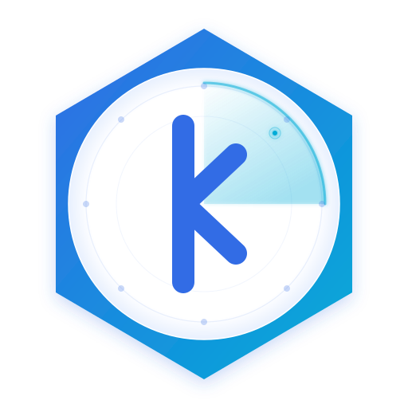

<p align="center">
  <a href="https://kwatch.dev">
    
  </a>
  <br />
  <a href="https://kwatch.dev">
    
  </a>
  <a href="https://pkg.go.dev/github.com/abahmed/kwatch">
    
  </a>
  <a href="https://github.com/abahmed/kwatch/actions/workflows/check.yml">
    
  </a>
  <a href="https://codecov.io/gh/abahmed/kwatch">
    
  </a>
  <a href="https://github.com/abahmed/kwatch/releases/latest">
    
  </a>
  <a href="https://github.com/abahmed/kwatch/releases">
    
  </a>
  <a href="https://github.com/abahmed/kwatch/blob/main/LICENSE">
    
  </a>
  <a href="https://github.com/abahmed/kwatch">
    
  </a>
  <a href="https://artifacthub.io/packages/helm/kwatch/kwatch">
    
  </a>
  <a href="https://discord.gg/kzJszdKmJ7">
    
  </a>
</p>

> **🚧 Unreleased** — documents the **v0.11.0-rc** dev build. The install snippets below stay pinned to the latest stable; the preview build has its own section. Removed automatically at release.

> **👋 New to Kubernetes? No problem.**  
> kwatch delivers **alerts that explain themselves** — what broke, *why*, the logs and events — straight to your team chat, 24/7.  
> ✨ **60 seconds to install. No backend. No dashboards. No YAML spaghetti.**  
> ⏰ kwatch is the **alarm**, not the dashboard — it doesn't collect metrics or store logs. It reads your cluster and pings you with the reason.

---

## 🧐 What is kwatch?

kwatch is a smart **alarm** for your Kubernetes cluster — every alert **explains itself**:

- 💥 Something crashes → you get a message that says *why* (not just "pod is broken").
- 🔇 Smart about noise — groups related issues into a single notification, ignores flapping.
- ⚡ No Prometheus, no Grafana, no 50-step setup. Just alerts that **make sense**.

---

## 🆚 kwatch vs the DIY stack

| | ✨ kwatch | 😰 Prometheus + Alertmanager |
|---|---|---|
| ⏱️ Setup time | **60 seconds** | hours of YAML |
| 📦 Footprint | 1 small pod, no storage | full monitoring stack + TSDB |
| 💬 Alerts | Self-explaining: *"OOMKilled — raise the memory limit, here are the logs"* | Whatever PromQL rules you hand-wrote |
| 📚 Learning curve | One ConfigMap | PromQL + alert rules |

---

## 🚨 Before vs After

| Raw kubectl output 🤷 | kwatch tells you 💡 |
|---|---|
| `CrashLoopBackOff` | 🚨 **OOMKilled** (memory limit: 512Mi) — try raising `limits.memory` · here are the logs + events |
| `Error` | 🚨 **HTTP probe** failing on `:8080/healthz` (exit 137) — container ran out of memory |
| `Pending` | ⏳ **Unschedulable** for 10m — none of the 5 nodes match the SSD pool request of `db-0` · scheduling events included |

---

## 💬 This is what you get

One real alert, as it lands in Slack (same shape in every provider):

```text
🚨 OOMKilled — production / orders-api
   Pod: orders-api-7ffc9d4f9-x9p4t   Node: worker-3   severity: high

   💡 Hint: memory limit is 512Mi. Try raising limits.memory.
      Recent logs + events below.

   📄 Logs:
      Exception in thread "main" java.lang.OutOfMemoryError: Java heap space
      at com.example.OrdersResource.list(OrdersResource.java:41)

   📋 Events:
      Killing container ... because it exceeded its memory limit (OOMKilled)
```

That's the resulting pod crash — explained, with the fix hinted, logs included, zero
digging. ✨

---

## ⚡️ 60-second install

<!-- stable-install:start -->

### 📦 Helm (easiest 🏆)

```shell
helm repo add kwatch https://kwatch.dev/charts
helm install [RELEASE_NAME] kwatch/kwatch --namespace kwatch --create-namespace --version 0.10.5
```

More details in the [chart docs](https://github.com/abahmed/kwatch/blob/main/deploy/chart/README.md)

To **upgrade** later: `helm upgrade [RELEASE_NAME] kwatch/kwatch --namespace kwatch --reuse-values`
(or bump the image tag of the Deployment).

### 🐙 kubectl

```shell
curl -L https://raw.githubusercontent.com/abahmed/kwatch/v0.10.5/deploy/config.yaml -o config.yaml
# ✏️ Edit config.yaml with your team-chat webhook
kubectl apply -f config.yaml
kubectl apply -f https://raw.githubusercontent.com/abahmed/kwatch/v0.10.5/deploy/deploy.yaml
```

<!-- stable-install:end -->

`config.yaml` is the only file you edit. One small block per place you want alerts:

```yaml
alert:
  slack:
    webhook: "https://hooks.slack.com/services/T00000000/B00000000/xxxxxxxx"
  discord:
    webhook: "https://discord.com/api/webhooks/123456/xxxxx"
```

All 56 providers, with every parameter and example, are in
[everything about providers](./docs/providers.md).

> **Everything you need:** any modern Kubernetes cluster, cluster-wide read access plus the
> permission to send alerts (kwatch ships its own RBAC in `deploy.yaml`), and a single pod —
> 1 replica, **no storage**. Running several clusters? Run one kwatch per cluster.

### ✅ First alert in 60 seconds

- `kwatch lint --check` — validates your config **and tests your provider credentials**.
- `curl -X POST http://<kwatch-pod>:8060/test-alert` — sends a test alert
  (enable `healthCheck.diagnostics: true`).
- Crash a test pod, the classic proof:
  `kubectl run boom --image=busybox:1.36 --restart=Always -- sh -c "sleep 5 && exit 1"`

### 🧪 Release candidate

<details>
<summary>Want the preview build?</summary>

<!-- rc-install:start -->

Current preview: **v0.11.0-rc.7** — not for production.

No Helm chart is published for release candidates, so install from the manifests at the RC
tag. They already pin the preview image, so this is all you need:

```shell
curl -L https://raw.githubusercontent.com/abahmed/kwatch/v0.11.0-rc.7/deploy/config.yaml -o config.yaml
# ✏️ Edit config.yaml with your team-chat webhook
kubectl apply -f config.yaml
kubectl apply -f https://raw.githubusercontent.com/abahmed/kwatch/v0.11.0-rc.7/deploy/deploy.yaml
```

Already running kwatch? Switch an existing install straight to the preview:

```shell
kubectl -n kwatch set image deployment/kwatch kwatch=ghcr.io/abahmed/kwatch:v0.11.0-rc.7
```

Check what you actually got:

```shell
kubectl -n kwatch get deployment kwatch -o jsonpath='{.spec.template.spec.containers[0].image}'
```

To go back to stable, re-run the install commands at the top of this page.

RC builds never get the `latest` tag, and the in-app upgrader stays quiet on them — you
opted into the dev channel, so kwatch won't nag you back toward stable.

<!-- rc-install:end -->

</details>

---

## 🎯 What does it catch?

Nearly everything, **out of the box — zero config**. Highlights:

| Signal | Default | What you get |
|--------|---------|-------------|
| 🟥 Pod crashes (CrashLoop, OOM, ImagePull) | ✅ on | Container state + logs + events — tells you *why* |
| ⏳ Pods stuck Pending / Unschedulable | ✅ on | Alerts with how long the scheduler has been stalling |
| 🖥️ Node issues (NotReady, Disk/Memory pressure) | ✅ on | Per-condition severity |
| 💾 PVC running out of space | ✅ on | Warn at 80%, critical at 90% |
| 🚀 Stuck rollouts & unavailable deployments | ✅ on | Missed the deploy window? You'll know. |
| 📈 HPA stuck at max replicas | ✅ on | After 20 minutes sustained |
| 🌐 Service/Ingress backends with no healthy pods | ✅ on | Traffic would fail — alerted before users notice |
| 🏛️ Broken control-plane components | ✅ on | apiserver, scheduler, etcd, coredns |
| 🔒 TLS certs expiring | ❌ off | Enable this one if you want |
| 💓 Heartbeat | ❌ off | Periodic "still alive" ping (default: every 5 min) |

✅ **TLS and heartbeat are the only ones off** — everything else just works. The full list —
failed Jobs, stuck CronJobs, admission webhooks, PDBs, network-policy blocks, node
overcommit, repeating OOMs and more — lives in the [configuration reference](./docs/configuration.md).

---

## ✨ Feature highlights

- 🧠 **Alerts that explain themselves** — every alert names the cause, the impact, and what
  recently changed (insight engine + dependency graph)
- 🔄 **Incident memory** — the same crash updates one thread instead of spamming; it resolves
  after a hold-down and revives silently past a cooldown
- 🔇 **Smart grouping** — related failures coalesce into one notification, re-notified on a
  gentle cooldown, batch-resolved together
- 📊 **Mass-failure detection** — 30% of a shared dependency down → one blast-radius alert
  that *replaces* the per-workload alerts rather than arriving alongside them, auto-resolved
  when it recovers
- 🚨 **Escalation & re-notify** — repeated crashes climb severity, and long-lived incidents
  nudge you again so nothing is forgotten
- 📜 **Audit log** — every decision (create / update / resolve / skip) as structured JSON,
  with suppressions recorded on change rather than on every poll
- 🕳️ **Knows when it was blind** — kwatch stamps its own liveness, so if it was down while your
  cluster wasn't, the next startup message says how long nobody was watching
- ♻️ **Live config** — change severity via `KwatchConfig` CRDs without restarting
- 🔁 **Delivery resilience** — per-provider routes, retries, and fallback, with a dead-letter
  view for the rare message that can't be sent
- 🩺 **Observable itself** — health endpoints and Prometheus metrics

---

## 📣 Alerts go anywhere

kwatch delivers to any of **56 alert providers** — your team chat, email, SMS, paging system,
or a plain webhook:

| Provider | Needs |
|:--|:--|
| 💬 Slack | webhook or bot token |
| 💬 Discord | webhook |
| 💼 Microsoft Teams | webhook |
| 📧 Email (SMTP) | SMTP creds + recipient |
| 🚨 PagerDuty | integration key |
| ✈️ Telegram | bot token + chat ID |
| 🔔 Opsgenie | API key |
| 🐕 Datadog | API key |
| ✉️ Twilio | account SID + phone numbers |
| 📋 Jira | URL + token + project |
| 🏠 HomeAssistant | token + URL |
| 🔗 Custom Webhook | any URL (+ headers) |

…and **44 more** — GitLab, Gitea, Matrix, Zulip, Splunk, SendGrid, AWS SNS/SES, GoAlert,
FeiShu, WeCom, n8n and more. Every parameter, example config, and routing/retry/fallback
options are in [everything about providers](./docs/providers.md).

---

## ⚙️ Configuration in a nutshell

The most useful knobs (everything else has a sensible default):

| Setting | What it does |
|:--|:--|
| `namespaces` | 🔽 Watch a few namespaces, or `!kube-system` to exclude |
| `reasons` | 🔽 Alert on specific reasons only, or exclude with `!` |
| `silences` | 🔕 Silence whole rules — namespace, reason, pod/container name, log pattern |
| `templates` | 📝 Custom message text per reason |
| `smartGrouping` | 🧹 Coalesce duplicate notifications (on by default) |
| `correlation` | 🧠 Group incidents, escalate repeat crashes, re-notify emergencies |
| `app.clusterName` | 🏷️ Name your cluster so alerts say *which* one failed |
| `includeEvents` / `includeLogs` | 📋 Toggle events/logs in alerts |
| `healthCheck` | 🩺 Health endpoints + optional `/incidents`, `/test-alert`, pprof |
| `upgrader.disableUpdateCheck` | 🔕 Stop the "new version available" nags |

The complete reference — all monitors, thresholds, templates, correlation, audit log, and
live-config CRDs — is in the [configuration reference](./docs/configuration.md).

---

## 🧠 Why alerts make sense

- 🗺️ kwatch maps pods to nodes, owners, services, PVCs, ConfigMaps, and Secrets — so an alert
  explains the **root cause**, not just the symptom.
- 📊 If a whole node or shared ConfigMap fails at once, kwatch detects the **mass failure**
  and tells you the blast radius instead of firing thousands of alerts.
- 📣 Every alert arrives with the **logs and events already attached** — no digging through
  dashboards to find out what happened.

Under the hood it's all explained in [how kwatch thinks](./docs/architecture.md).

Release images are signed and published with a source commit, immutable digest,
and checksums. See [release integrity](./docs/release-integrity.md) if your
organization requires artifact verification. See
[licensing](./docs/licensing.md) for the MIT terms and
[third-party notices](./docs/third-party-notices.md) for dependency licenses.

---

## 🛠️ CLI commands

| Command | What it does |
|:---|:---|
| `kwatch` | ▶️ Run the main monitor |
| `kwatch --version` | ℹ️ Print version |
| `kwatch version` | ℹ️ Print version, source commit, and build date |
| `kwatch version --json` | ℹ️ Print machine-readable build identity |
| `kwatch lint` | ✅ Validate your config |
| `kwatch lint --strict` | ✅✅ Strict check (catches typos!) |
| `kwatch lint --check` | ✅✅✅ Validate + test provider credentials |
| `kwatch replay [--dry-run] < events.jsonl` | 🎬 Replay a saved event stream to test your setup; dry-run only prints what would be sent |

---

## 🧹 Clean up

<!-- stable-install:start -->

```shell
kubectl delete -f https://raw.githubusercontent.com/abahmed/kwatch/v0.10.5/deploy/config.yaml
kubectl delete -f https://raw.githubusercontent.com/abahmed/kwatch/v0.10.5/deploy/deploy.yaml
```

<!-- stable-install:end -->

Installed with Helm instead? `helm uninstall [RELEASE_NAME] --namespace kwatch`

---

## 📖 Not a monitoring platform — and proud of it! 🎉

kwatch is **not** a metrics collector, dashboard, or observability backend. No TSDB, no
dashboards, no log storage. kwatch is the **alarm** — when something breaks, it tells you
**right now**, with a reason. Pair it with Prometheus + Grafana for metrics and Loki for
logs; those tell you what happened, kwatch is the one that wakes you up. ⏰

---

## 👍 Contribute & Support

+ ⭐ [Give us a star](https://github.com/abahmed/kwatch/stargazers) — it really helps!
+ 💡 [Suggest features](https://github.com/abahmed/kwatch/issues)
+ 🐛 [Report bugs](https://github.com/abahmed/kwatch/issues)
+ 🔧 [Contributing guidelines](./CONTRIBUTING.md)
+ 🔖 How versioning and releases work — see [RELEASES.md](./RELEASES.md)

---

## 📚 Documentation

- [⚙️ Configuration reference](./docs/configuration.md)
- [📣 Alert providers](./docs/providers.md)
- [🧠 How kwatch thinks](./docs/architecture.md)
- [📦 Helm chart](./deploy/chart/README.md)
- [🔖 Versioning & releases](./RELEASES.md)

---

## 🚀 Who uses kwatch?

**kwatch** is trusted by:

[](https://www.trella.app)
[](https://ibecsystems.com/en#/)
[](https://www.justwatch.com/us/talent)

Want to add your company? [Open an issue!](https://github.com/abahmed/kwatch/issues)

---

## 💻 Contributors

<a href="https://github.com/abahmed/kwatch/graphs/contributors">
  
</a>

---

## ⭐️ Stargazers


---

## 👋 Get in touch

Questions? Suggestions? [Chat with us on Discord](https://discord.gg/kzJszdKmJ7) — we're friendly! 🎉

## ⚠️ License

kwatch is free and open source under the [MIT License](LICENSE).
