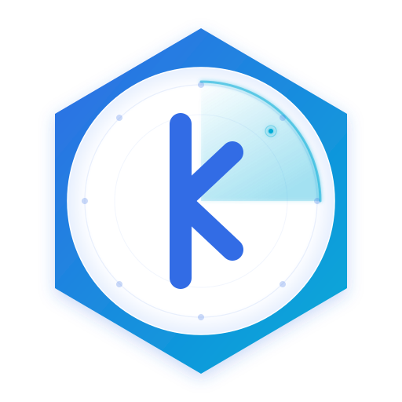
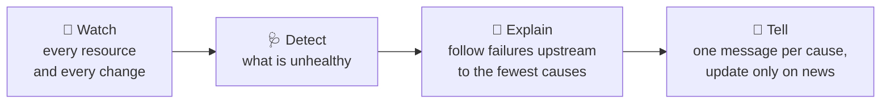

<p align="center">
  <a href="https://kwatch.dev">
    
  </a>
</p>

<h2 align="center">See what broke. Understand why. Know what to do next. 👀🧠⚡</h2>

<p align="center">
  kwatch is the on-call teammate for your Kubernetes cluster. When something
  breaks, it finds <b>the one thing that caused it</b> and tells your team in
  plain words, with the command to fix it.
</p>

<p align="center">
  <a href="#-get-started-in-one-command"><b>Get started</b></a> ·
  <a href="https://kwatch.dev">Website</a> ·
  <a href="https://kwatch.dev/docs/getting-started">Docs</a> ·
  <a href="https://discord.gg/kzJszdKmJ7">Discord</a>
</p>

<p align="center">
  <a href="https://github.com/abahmed/kwatch/releases"></a>
  <a href="https://github.com/abahmed/kwatch/stargazers"></a>
  <a href="https://github.com/abahmed/kwatch/actions/workflows/ci.yml"></a>
  <a href="./LICENSE"></a>
</p>

---

## 😩 2:14 AM. Your phone lights up twenty times.

A release went out. Now pods are crash looping, a Service has no endpoints,
the Ingress returns 503s, and two other apps are failing their health checks.
Every alert is true. **None of them tells you why.** So you open a terminal
and start digging.

## 😌 With kwatch, you get one message

<table>
<tr>
<th width="50%">Typical alerts without kwatch</th>
<th width="50%">With kwatch</th>
</tr>
<tr>
<td valign="top">

```text
🔥 Pod api-7d9f-x2k CrashLoopBackOff
🔥 Pod api-7d9f-q8n CrashLoopBackOff
🔥 Pod api-7d9f-m4c CrashLoopBackOff
⚠️ Service api has no endpoints
⚠️ Ingress storefront 503
🔥 Pod checkout-5b2c-p1z Readiness failed
🔥 Pod checkout-5b2c-k7w Readiness failed
... 13 more
```

</td>
<td valign="top">

```text
🔴 api is down in shop (prod-eu-1)
after the 14:02 release of api:2.3. alice
released it; the previous image was
api:2.2. Only pods of the new
revision fail. Service api and
ingress storefront can't serve traffic.
checkout is affected as well. Rolling
back fixes it (changes the cluster):
kubectl rollout undo deployment/api
-n shop --to-revision=13
```

</td>
</tr>
</table>

**What broke, why, who changed it, what else is hit, and how to fix it**, in
one message, before you have even opened your laptop. When it is fixed, you
hear about it once:

```text
✅ api in shop (prod-eu-1) is healthy again. It was down for eight
minutes.
```

## ✨ Why teams pick kwatch

<table>
<tr>
<td width="50%" valign="top">

### 🎯 The cause, not the symptoms
kwatch follows a failure back through everything it depends on, and names
the root: a bad release, a full node, an expired certificate, a database
outside the cluster. Twenty symptoms become one incident.

</td>
<td width="50%" valign="top">

### 🔕 Quiet by default
Successful rollouts, scaling, node drains, finished Jobs and the odd pod
restart never wake anyone. Updates are sent only when something new is
true. A storm of 1,000 failing pods from one cause is at most 3 messages.

</td>
</tr>
<tr>
<td valign="top">

### 🧠 Knows what changed
Every rollout, config edit and image update goes on a timeline with who made
it, so the message can say *"after alice's 14:02 release"*. It even
remembers changes made while kwatch itself was restarting.

</td>
<td valign="top">

### 🛠️ Tells you what to run
Each message ends with the next step: the exact `kubectl` command to read
the crash log, describe the node, or roll back. New team members can act on
it without knowing the cluster.

</td>
</tr>
<tr>
<td valign="top">

### 🌐 Sees the whole cluster
Every Kubernetes resource, Gateway API, snapshots and your own CRDs, with
the links between them. If it has a status, kwatch understands it.

</td>
<td valign="top">

### 🔒 Yours, in your cluster
One small Pod, read-only access, no account, no SaaS. Your cluster data
never leaves your cluster except as the alerts you configure.

</td>
</tr>
</table>

## ⚙️ How it works


```mermaid
flowchart LR
  A["👀 Watch<br/>every resource<br/>and every change"] --> B["🩺 Detect<br/>what is unhealthy"]
  B --> C["🎯 Explain<br/>follow failures upstream<br/>to the fewest causes"]
  C --> D["📨 Tell<br/>one message per cause,<br/>update only on news"]
```

1. **Watch.** kwatch keeps a live map of your cluster: every object, how they
   connect, and a timeline of what changed and who changed it.
2. **Detect.** It spots what is unhealthy: crash loops, unready nodes,
   Services with no endpoints, full volumes, failing webhooks and more.
3. **Explain.** From each failure it walks to what it depends on and keeps
   only suspects that are broken or changed just before. Then it picks the
   fewest causes that explain everything.
4. **Tell.** One message per cause, written for people. It is updated only
   when something new is true, and closed once when it is fixed.

## 🔁 Before and after

One node runs low on memory and starts evicting pods. Here is the same
incident in your channel, twice.

**Before: one alert per pod**

```text
🔥 Pod api-7d9f-x2k CrashLoopBackOff
🔥 Pod orders-5b2c-p1z CrashLoopBackOff
⚠️ Pod cart-6c8d-k7w Readiness probe failed
⚠️ Deployment api unavailable
🔥 Pod api-7d9f-x2k restarted (5 times)
⚠️ Node pool-a-n1 NotReady
✅ Node pool-a-n1 Ready
⚠️ Node pool-a-n1 NotReady
... 14 more
```

**After: one message with the cause, then one when it is over**

Messages are written as short lines, with the resource names in bold, text
from your pods in code and the command in a code block. Slack, Discord,
Telegram, Jira and the other chat and ticket providers show it as below;
SMS, push and pager providers get the same lines as plain text.

```text
🟠 **Node n1** (**prod-eu-1**) is low on memory. All of its dependents are failing.
Replicas that do not depend on it are healthy.
**cart**, **orders** and **api** in **shop** are affected as well.
To check the node's conditions and recent events, run
    kubectl describe node n1
```

```text
✅ **Node n1** (**prod-eu-1**) is ready again. It was failing for ten minutes.
```

The same goes for the other incidents you care about:

```text
🟠 **api** is failing in **shop** (**prod-eu-1**) after the 10:01 release of registry.example.com/api:2.3.
The previous image was registry.example.com/api:2.2.
It fails with `panic: missing key DB_PASSWORD_V2`.
To see the rollout state, run
    kubectl rollout status deployment/api -n shop
```

Messages that list several problems are short lists, the ones that need
attention first and what resolved on one line. kwatch reports what is
happening, not what could happen: advice such as a single replica or a missing
probe is never listed:

```text
🟡 **kwatch digest** · staging — 2 problems · 5 resolved

**Problems**
• Node **ip-10-0-67-211** — failing again
• Service **ingress-nginx** (**kube-addons**) — Kubernetes reported FailedDeployModel 3 times in the last quarter hour

✅ 5 resolved since last digest: accounts, assets, comms +2
```

```text
🟠 **kwatch** · prod-eu-1 — 2 new problems at the same time

**Problems**
• **ledger** in **billing** keeps crashing
• **checkout** in **orders** keeps crashing

_Each gets its own message when it changes or resolves._
```

One message per problem, with its cause and the command to fix or check it.
Known and low-priority problems stay quiet, and the resolve message tells you
what happened.

## 💬 More real messages

When five apps fail because a database outside the cluster is down, kwatch
blames the database, not the apps:

```text
🟠 api in shop (prod-eu-1) keeps crashing because external endpoint
db.example.com:5432 refuses connections. It fails with "dial tcp
db.example.com:5432: connect: connection refused". Every error mentions it.
cart, search, auth and one other are affected as well. To read the output
of the last crash, run
kubectl logs api-6d4f-0 -c app -n shop --previous
```

When a node disappears:

```text
🔴 Node n1 (prod-eu-1) has not reported for about two minutes. It reports
"Kubelet stopped posting node status". To check the node's conditions and
recent events, run kubectl describe node n1
```

When kwatch is not sure, it says so instead of guessing. One emoji tells you
how urgent it is: 🔴 page · 🟠 notify · 🟡 low · ✅ resolved.

## 🚀 Get started in one command

```bash
/bin/bash -c "$(curl -fsSL https://kwatch.dev/kwatch.sh)"
```

The installer asks which cluster and which channel (Slack, Teams, PagerDuty,
…), stores the credentials in a Kubernetes Secret, installs kwatch and checks
that it is running. Run it again any time to upgrade, change settings or
uninstall.

Prefer Helm? `helm repo add kwatch https://kwatch.dev/charts`, then follow
the [chart guide](./deploy/chart/README.md).

## 📣 Alerts where your team already is

**56 destinations**, including Slack, Microsoft Teams, Discord, Google Chat,
Mattermost, Telegram, email, PagerDuty, Opsgenie, incident.io, Jira, Datadog
and plain webhooks. Paging tools get a stable key, so the same problem always
updates the same page and closes it when it is fixed.
[See all channels →](https://kwatch.dev/docs/channels)

## 🔍 What it catches

| | |
| --- | --- |
| 📦 **Apps** | Crash loops, OOM kills, bad rollouts, stuck Jobs and CronJobs, missing replicas |
| 🗓️ **Scheduling** | Pods that cannot be placed, quota limits, affinity and taint mismatches |
| 🖥️ **Nodes** | Lost or not-ready nodes, memory, disk and PID pressure |
| 🌐 **Network** | Services without endpoints, broken Ingress and Gateway routes, failing webhooks, unreachable external endpoints |
| 💾 **Storage** | Nearly full volumes, failed attachments, stuck claims |
| 🔐 **Config** | Missing or rotated Secrets and ConfigMaps, image pull failures, expiring certificates |
| 🧩 **Your CRDs** | Anything that reports standard status conditions |

[Full coverage list →](./docs/kubernetes-coverage.md)

## 📏 Tested like a product, not a script

Every change to kwatch is replayed against a library of real failure
scenarios, plus a hidden set nobody is allowed to tune for. The build
**fails** if it gets worse:

| We promise | And CI checks |
| --- | --- |
| It names the right cause | ≥ 90% of scenarios, ≥ 80% of the hidden set |
| It rarely claims a wrong cause with confidence | ≤ 5% |
| It never alerts on normal operations | 0 alerts |
| It is fast | page in ≤ 2 min, notify in ≤ 5 min |
| It stays small | 5,000 pods and 500 nodes in 512 MiB of memory |

[Latest scorecard →](./internal/scenarios/SCORECARD.md)

## ❓ FAQ

<details>
<summary><b>Does it replace Prometheus or Grafana?</b></summary>

No. kwatch answers *"what just broke and why"*. Keep Prometheus, Grafana and
Loki for metrics, trends and dashboards; kwatch needs no rules and works
next to them.
</details>

<details>
<summary><b>Does my data leave the cluster?</b></summary>

Only as the alerts you configure. Secrets and tokens are redacted from logs
and messages. kwatch also sends a weekly anonymous ping (a hashed cluster ID
and its version, nothing else) so we know how many clusters use it; turn it
off with `telemetry.enabled: false`.
</details>

<details>
<summary><b>What access does it need?</b></summary>

Read-only access to cluster state. It writes only its own Lease, its
state file, and SelfSubjectAccessReviews for its permission audit (not
persisted). It never gets `pods/exec` or `nodes/proxy`. A least-privilege
mode and a `watch.secrets: false` opt-out are available.
</details>

<details>
<summary><b>How much does it cost to run?</b></summary>

kwatch is free to use in your own clusters. It runs as one Pod with a
512 MiB memory limit and a 2 GiB volume for its state.
</details>

<details>
<summary><b>What happens when kwatch restarts?</b></summary>

It picks up where it left off: open incidents are not announced again,
queued alerts are still sent, and changes made while it was down are still
used to explain failures. It runs as one replica (no HA) and delivers alerts
at least once. See [production operations](./docs/production-operations.md).
</details>

<details>
<summary><b>Can I tune what it sends?</b></summary>

Yes: namespace filters, silences, maintenance annotations, severity
overrides, runbook links, an hourly message budget per channel, and
configuration through a `KwatchConfig` resource (kwatch restarts to apply it).
See the
[configuration guide](./docs/configuration.md).
</details>

## 🤝 Join us

kwatch is built in the open. Report a bug, suggest an idea, or send a pull
request. New contributors can start with the
[plain-English architecture guide](./docs/contributor-architecture.md) and
step-by-step guides for adding a
[detector](./docs/contributing-detector.md),
a [propagation rule](./docs/contributing-propagation-rule.md) or a
[scenario](./docs/contributing-scenario.md).

[Open an issue](https://github.com/abahmed/kwatch/issues) ·
[Join Discord](https://discord.gg/kzJszdKmJ7) ·
[CONTRIBUTING.md](./CONTRIBUTING.md)

If kwatch saves you a night, ⭐ the repo so others can find it.

## 📄 License

Source available under the [Elastic License 2.0](./LICENSE): use it free in
your own clusters, read and change the code, and share it. You may not offer
kwatch as a hosted service or remove its license checks. Releases up to and
including `v1.0.0-rc.10` remain under the MIT License. See
[licensing](./docs/licensing.md).
